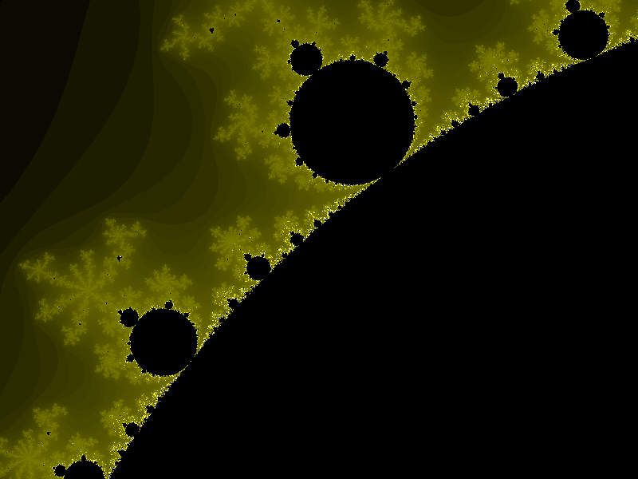
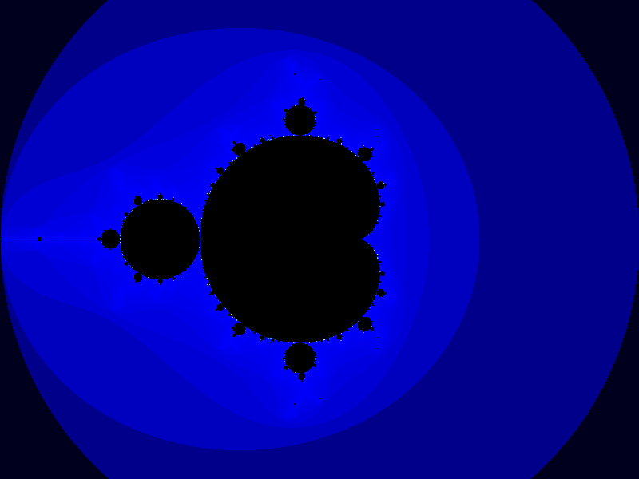
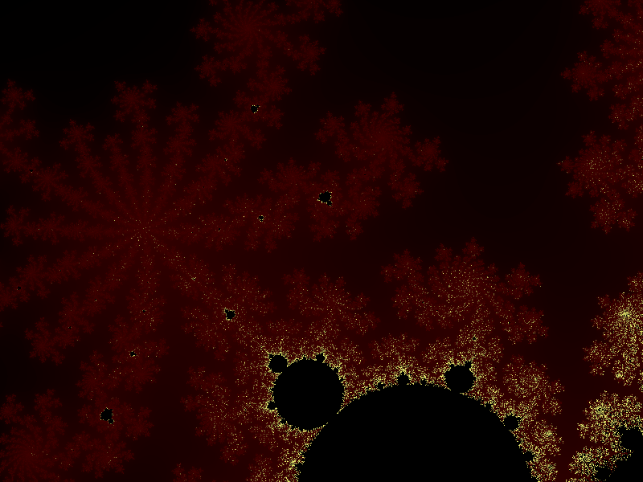

# FractalImageCreator

The final project of the **Learn Advanced C++ Programming** course from **Udemy** ([link](https://www.udemy.com/course/learn-advanced-c-programming))

## Details about the project

 - *Project's objective*: Generate a fractal and save it to a Bitmap image file
 - *Programming language*: **C++** (11)
 - *IDE used*: **Eclipse IDE 2020-03**
 - *Third-party libraries used*: none
 - *Implementation details*:
	 - ***mainApp.cpp*** is the main file of the project which contains the trigger of the fractal generation after the iterations intervals and their associated colors are defined and after the zooms are also defined
	 - 6 classes are defined and used: 
		 - **Bitmap** (***Bitmap.h***, ***Bitmap.cpp***) for writing a Bitmap file with the actual data, the data which has to be written at the beginning of a Bitmap file in order to be a valid file (defined in the **BitmapFileHeader.h** file) and the information about the Bitmap data (defined in the **BitmapInfoHeader.h** file)
		 - **Mandelbrot** (***Mandelbrot.h***, ***Mandelbrot.cpp***) for calculating the number of iterations for each pixel of the fractal
		 - **Zoom** (***Zoom.h***) for manipulating a "zoom" (i.e. the pixel's coordinates where the zoom is desired and the scale).
		 - **ZoomList** (***ZoomList.h***, ***ZoomList.cpp***) for manipulating a list of "zooms"
		 - **FractalCreator** (***FractalCreator.h***, ***FractalCreator.cpp***) for creating the fractal
		 - **RGB** (***RGB.h***, ***RGB.cpp***) for manipulating colors in the RGB format.
		 
	 - The simulation can be modified by:
		 - Changing the *MAX_ITERATIONS* parameter from *Mandelbrot.h* which represents the maximum number of iterations used for generating each pixel of the fractal
		 - Changing the *MAX_LIMIT* parameter from *Mandelbrot.h* which represents the maximum limit of the absolute value of the complex number on which the each pixel of the fractal is defined
		 - The iterations intervals and the associated colors for their ends from *main.cpp*
		 - The zooms list from *main.cpp* for centering and scaling on different areas of the fractal
 - Results: \

